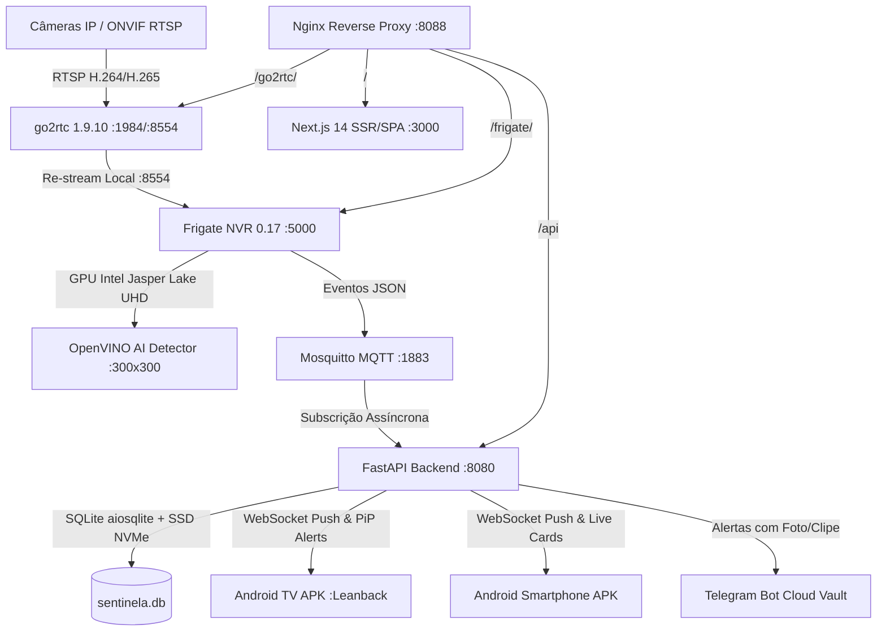

# SentinelaFrigate PRO — Documentação Completa da Aplicação

> **Versão do Sistema:** `v001.000.000.068` (SentinelaPro Enterprise Edition)  
> **Arquitetura Base:** Docker Microservices, FastAPI Assíncrono, Next.js 14 Standalone, Frigate NVR 0.17 com OpenVINO, go2rtc 1.9.10 WebRTC/MSE Streaming, Eclipse Mosquitto MQTT, Android TV & Smartphone Jetpack Compose Apps.

---

## 1. Visão Geral da Arquitetura

O ecossistema **SentinelaFrigate PRO** é um sistema de monitoramento perimetral e inteligência artificial de alta disponibilidade voltado para operação contínua 24/7 com máxima eficiência de hardware.



---

## 2. Mapa de Serviços e Portas de Rede

| Serviço | Porta Interna | Porta Host | Protocolo | Função Principal |
| :--- | :--- | :--- | :--- | :--- |
| **Nginx Gateway** | 80 | **8088** | HTTP | Ponto de entrada unificado para Frontend, Backend, Frigate e Streams |
| **Sentinela Backend** | 8080 | **8080** | HTTP / WS | API Core FastAPI, orquestração de banco, MQTT e telemetria |
| **Sentinela Frontend**| 3000 | 3000 (Internal) | HTTP | Interface Web Next.js 14 com Mosaico WebRTC e Gestão de Telas |
| **Frigate NVR** | 5000 | **5000** | HTTP | Gravação contínua em NVMe, detecção IA, clips e review |
| **go2rtc Streaming** | 1984 | **1984** | HTTP / WS | Servidor WebRTC, MSE, RTSP e MJPEG de latência ultra-baixa |
| **go2rtc RTSP Bus** | 8554 | **8554** | RTSP | Barramento de retransmissão interna de vídeo para Frigate |
| **go2rtc WebRTC UDP**| 8555 | **8555** | UDP / TCP | Negociação de candidatos ICE / STUN WebRTC |
| **Mosquitto MQTT** | 1883 | **1883** | TCP | Broker de mensagens Pub/Sub de detecção em tempo real |

---

## 3. Catálogo de Endpoints da API REST (`/api`)

A API RESTful do Sentinela expõe **72 endpoints** categorizados em 6 módulos principais:

### 3.1. Módulo de Câmeras (`/api/cameras`)

* `GET /api/cameras` ou `GET /api/cameras/`: Retorna a lista unificada de todas as câmeras cadastradas com telemetria em tempo real (FPS de câmera, FPS de detecção e status online) com cache em memória de sub-3ms.
* `POST /api/cameras/`: Cadastra uma nova câmera no banco e atualiza imediatamente o `config.yml` do Frigate e go2rtc sem necessidade de reinicialização manual.
* `PATCH /api/cameras/{camera_id}`: Atualiza parâmetros de IA, zonas, RTSP principal, sub-stream, FPS eco, gravação contínua ou por movimento e sensibilidade.
* `DELETE /api/cameras/{camera_id}`: Remove a câmera do banco e purga sua configuração do NVR.
* `POST /api/cameras/test-rtsp`: Testa a conectividade TCP com predição de portas (testa porta 554 se porta 8554 falhar).
* `POST /api/cameras/sync-frigate`: Força a sincronização bidirecional entre o banco SQLite e o `config.yml` do Frigate.
* `POST /api/cameras/{camera_id}/toggle-pause`: Alterna instantaneamente a câmera entre modo Ativo e Standby (para economia de energia e privacidade).
* `POST /api/cameras/{camera_id}/pause`: Pausa a câmera e desativa o processo do FFmpeg no Frigate.
* `POST /api/cameras/{camera_id}/resume`: Retoma a câmera no Frigate.
* `GET /api/cameras/{camera_id}/diagnostics`: Retorna status aprofundado com contagem de produtores/consumidores no go2rtc e logs do FFmpeg.
* `GET /api/cameras/{camera_id}/zones` e `POST /api/cameras/{camera_id}/zones`: Consulta e atualiza as zonas poligonais ROI de segurança.

### 3.2. Módulo de Dispositivos e Telas PiP (`/api/devices`)

* `GET /api/devices`: Lista todas as Smart TVs, Smartphones e Kiosks emparelhados, com status de permissão e telemetria.
* `POST /api/devices/heartbeat` (ou `/api/devices/ping`): Endpoint consumido automaticamente pelos APKs a cada 10 segundos com reconciliação anti-duplicação via MAC e impressão digital de hardware.
* `POST /api/devices/deduplicate`: Limpa e consolida dispositivos duplicados no banco de dados decorrentes de reinstalações de aplicativo.
* `GET /api/devices/discover`: Varredura local via SSDP / mDNS para localizar Smart TVs, Android TVs e Chromecasts na rede.
* `GET /api/devices/health`: Status binário rápido (online/offline) de todas as telas.
* `POST /api/devices/{device_id}/test`: Dispara um teste individual de overlay Picture-in-Picture diretamente na tela selecionada.
* `POST /api/devices/batch-test`: Transmite um alerta de teste simultâneo para todas as telas autorizadas da casa.
* `POST /api/devices/{device_identifier}/pip-ack`: Confirmação enviada pela Smart TV comprovando que o overlay foi renderizado com sucesso na tela com suas dimensões e tempo.
* `POST /api/devices/{device_id}/toggle-pip`: Alterna o recebimento de alertas PiP daquela tela com 1 clique.
* `POST /api/devices/{device_identifier}/toggle-master`: Concede ou revoga privilégios MASTER de administração para um smartphone.
* `POST /api/devices/by-id/{device_identifier}/restart-containers`: Reinicialização remota segura de contêineres Docker executada a partir de um smartphone MASTER.
* `POST /api/devices/by-id/{device_identifier}/reboot-server`: Comando autenticado para reinicialização total do servidor Ubuntu host.

### 3.3. Módulo de Eventos & Gravações (`/api/events`)

* `GET /api/events`: Retorna a lista paginada de detecções e alertas históricos com suporte a filtros por câmera, label (`person`, `car`, etc.), data e período.
* `GET /api/events/summary`: Métricas agregadas de detecções (total por categoria, distribuição horária e tendências).
* `GET /api/events/{event_id}/clip.mp4`: Transmissão do clipe de vídeo gravado com suporte a HTTP 206 Partial Content (seek instantâneo nativo).
* `POST /api/events/{event_id}/retain`: Marca ou desmarca o evento como Favorito/Protegido contra rotação e expiração.
* `DELETE /api/events/{event_id}`: Exclusão individual de gravação.
* `POST /api/events/batch-delete`: Exclusão atômica em lote de dezenas ou centenas de gravações selecionadas.
* `DELETE /api/events/by-date`: Purga em massa de gravações por faixa de data.
* `GET /api/events/audit/logs`: Consulta dos logs da trilha de auditoria do sistema.

### 3.4. Módulo de Telemetria e Diagnósticos (`/api/telemetry`)

* `GET /api/telemetry`: Telemetria em tempo real com uso de CPU, temperatura dos núcleos (°C), consumo de RAM, ocupação do SSD NVMe e velocidade de rede.
* `GET /api/telemetry/stats-detailed`: Breakdown por núcleo da CPU Jasper Lake, partições NVMe e top processos Ubuntu.
* `GET /api/telemetry/frigate-status`: Conectividade profunda com o Frigate REST API, barramento MQTT e streams go2rtc.
* `GET /api/telemetry/diagnostics`: Verificação de aceleração de hardware VAAPI Intel (`/dev/dri/renderD128`).
* `GET /api/telemetry/logs`: Visualização dos logs dos contêineres Docker em tempo real.
* `POST /api/telemetry/benchmark`: Execução de testes de estresse em hardware (inferência de IA, processamento gráfico e codificação de vídeo).

### 3.5. Módulo de Configurações & Telegram (`/api/settings`)

* `GET /api/settings/`: Leitura das configurações globais e estado do modo Não Perturbe (DND).
* `POST /api/settings/dnd`: Ajuste dos horários de silenciamento de alertas noturnos.
* `POST /api/settings/telegram`: Gravação das credenciais do Telegram Cloud Vault (Token e Chat ID) com criptografia local.
* `POST /api/settings/telegram/test`: Envio de mensagem de teste para o bot do Telegram.
* `POST /api/settings/telegram/test-photo`: Envio de snapshot de alta definição com metadados para o Telegram.
* `POST /api/settings/telegram/test-video`: Envio de clipe gravado para o Telegram.
* `GET /api/settings/backup/db`: Download instantâneo do banco de dados SQLite (`sentinela.db`).
* `POST /api/settings/backup/telegram`: Envio do arquivo de backup do banco para o chat do Telegram.

### 3.6. Módulo Scanner de Rede (`/api/scanner`)

* `POST /api/scanner/run`: Sondagem de broadcast WS-Discovery e ONVIF na rede local localizando novos dispositivos de vigilância.

---

## 4. Guia de Compilação dos APKs no GitHub Codespaces

Para compilar os APKs oficiais (Android TV e Android Smartphone) em qualquer ambiente sem necessidade do Android Studio local:

1. Abra o repositório no **GitHub Codespaces**.
2. Execute a sequência no terminal do Codespaces:

```bash
# Atualize o branch e tags locais
git fetch origin --tags
git checkout main

# Torne o script de compilação executável
chmod +x compile_apk.sh

# Inicie a compilação Gradle em modo release
./compile_apk.sh
```

3. Ao final da compilação, os pacotes estarão gerados na raiz do projeto:
   - `sentinela-android-tv-latest.apk` (Interface Leanback com 10-foot UI para Smart TVs)
   - `sentinela-android-smartphone-latest.apk` (Interface vertical estilo YouTube Shorts com pinch-to-zoom)
